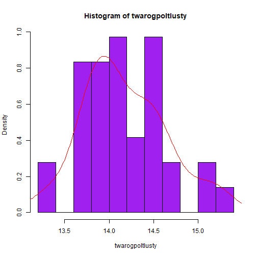

Praca zaliczeniowa
========================================================
author: Bartlomiej Warzecha 1K231 nr. albumu: 38723
date:  04 styczen 2021
autosize: true
transition: rotate
font-import: https://fonts.googleapis.com/css2?family=Old+Standard+TT
font-family: 'Old Standard TT'


Etapy wczytywania danych, edycji wstepnej oraz wybrane obliczenia sa ukryte w pliku .Rpres. Funkcje wyswietlajace dane, pomocne w trakcie edycji zostaly usuniete.
========================================================

- Dla najlepszego odbioru prezntacji, powiekszenie w przegladarce nalezy ustawic na  90%


Miary tendencji centralnej i rozrzutu(1) Mleko
========================================================

Pierwszy Produkt Mleko - Malopolskie


```r
mlekokrowiespożywcze<-dane[dane$region=="MAŁOPOLSKIE",5]
min(mlekokrowiespożywcze) : max(mlekokrowiespożywcze)
```

```
[1] 2.6
```

```r
quantile(mlekokrowiespożywcze) 
```

```
    0%    25%    50%    75%   100% 
2.6000 2.6700 2.6900 2.7225 2.8200 
```

```r
median(mlekokrowiespożywcze) 
```

```
[1] 2.69
```

Miary tendencji centralnej i rozrzutu(2) Mleko
========================================================


```r
mean(mlekokrowiespożywcze) 
```

```
[1] 2.702778
```

```r
quantile(mlekokrowiespożywcze)[4] - quantile(mlekokrowiespożywcze)[2] 
```

```
   75% 
0.0525 
```

```r
var(mlekokrowiespożywcze) 
```

```
[1] 0.002746349
```

```r
median(mlekokrowiespożywcze) 
```

```
[1] 2.69
```

Miary tendencji centralnej i rozrzutu(3) Mleko
========================================================


```r
sd(mlekokrowiespożywcze)
```

```
[1] 0.05240562
```

```r
sd(mlekokrowiespożywcze)/sqrt(length(mlekokrowiespożywcze))
```

```
[1] 0.00873427
```

```r
mad(mlekokrowiespożywcze)
```

```
[1] 0.029652
```

```r
sd(mlekokrowiespożywcze)/mean(mlekokrowiespożywcze) 
```

```
[1] 0.01938954
```

Miary tendencji centralnej i rozrzutu Pierwszy Produkt Podsumowanie
========================================================

Wnioski: <br/>

 - srednie zróżnicowanie cen wynosi okolo 0.05zl. Czyli typowym obszarem zmiennosci
  jest zakres od 2.7 - 0.05 = 2.65 do 2.7 + 0.05 = 2.75.

 - dla mediany typowym zakresem zmiennosci jest
   zakres od 2.69 - 0.0525 = 2.6475 do 2.69 + 0.0525 = 2.7425 
 
 - jezeli przyjmiemy, że wybrana próba jest losowa i reprezentuje populacj cen 
   mleka ro przyjmujac jako przecietna wartosc srednia(2.7)
   popenilismy blad +- 0.009.
 
 - wartosc wspolczynnika zmiennosci na poziomie ok. 0.019 mówi o stosunkowo malym
 zróżnicowaniu danych
   

Miary tendencji centralnej i rozrzutu Twarog(1)
========================================================

Drugi Produkt - Twarog  - Slask


```r
twarogpoltlusty<-dane[dane$region=="SLASKIE",6]
min(twarogpoltlusty) : max(twarogpoltlusty)
```

```
[1] 13.27 14.27 15.27
```

```r
quantile(twarogpoltlusty) 
```

```
   0%   25%   50%   75%  100% 
13.27 13.81 14.07 14.46 15.27 
```

```r
median(twarogpoltlusty) 
```

```
[1] 14.07
```

Miary tendencji centralnej i rozrzutu Twarog(2)
========================================================


```r
mean(twarogpoltlusty) 
```

```
[1] 14.17917
```

```r
quantile(twarogpoltlusty)[4] - quantile(twarogpoltlusty)[2] 
```

```
 75% 
0.65 
```

```r
var(twarogpoltlusty) 
```

```
[1] 0.2172136
```

```r
sd(twarogpoltlusty) 
```

```
[1] 0.4660618
```

Miary Miary tendencji centralnej i rozrzutu Twarog(3)
========================================================


```r
sd(twarogpoltlusty)/sqrt(length(twarogpoltlusty))
```

```
[1] 0.07767696
```

```r
mad(twarogpoltlusty) 
```

```
[1] 0.437367
```

```r
sd(twarogpoltlusty)/mean(twarogpoltlusty)
```

```
[1] 0.03286948
```


Miary tendencji centralnej i rozrzutu Drugi Produkt Podsumowanie
========================================================

Wnioski: <br/>

 - srednie zróżnicowanie cen wynosi okolo 0.47zl. Czyli typowym obszarem zmiennosci
  jest zakres od 14.12 - 0.47 = 13.65 do 14.12 + 0.47 = 14.59.

 - dla mediany typowym zakresem zmiennosci jest
   zakres od 14.07 - 0.65 = 13.42 do 14.07  + 0.65 = 14.72 
 
 - jezeli przyjmiemy, że wybrana próba jest losowa i reprezentuje populacj cen 
   twarogu to przyjmujac jako przecietna wartosc srednia(14.18)
   popenilismy blad +- 0.078.
 
 - wartosc wspolczynnika zmiennosci na poziomie ok. 0.033 mówi o stosunkowo malym
 zróżnicowaniu danych
   

Miary tendencji centralnej i rozrzutu karpia(1)
========================================================

Trzeci Produkt - Karp - Malopolskie


```r
karpswieży<-dane[dane$region=="MAŁOPOLSKIE",2]

min(karpswieży):max(karpswieży)
```

```
 [1]  0  1  2  3  4  5  6  7  8  9 10 11 12 13 14 15 16 17
```

```r
quantile(karpswieży)
```

```
     0%     25%     50%     75%    100% 
 0.0000  0.0000  0.0000 13.8175 17.5000 
```

```r
median(karpswieży) 
```

```
[1] 0
```

Miary tendencji centralnej i rozrzutu karpia(2)
========================================================

```r
mean(karpswieży) 
```

```
[1] 5.074167
```

```r
quantile(karpswieży)[4] - quantile(karpswieży)[2] 
```

```
    75% 
13.8175 
```

```r
var(karpswieży) 
```

```
[1] 54.03016
```

```r
sd(karpswieży) 
```

```
[1] 7.350521
```

Miary tendencji centralnej i rozrzutu karpia(3)
========================================================


```r
sd(karpswieży)/sqrt(length(karpswieży)) 
```

```
[1] 1.225087
```

```r
mad(karpswieży) 
```

```
[1] 0
```

```r
sd(karpswieży)/mean(karpswieży) 
```

```
[1] 1.448616
```


Trzeci Produkt Podsumowanie
========================================================

Wnioski: <br/>
 - Obszar zmiennosci wychodzi ujemny,
 - Zakladam, że ma to zwiazek z najczestszym czasem zakupu Karpia, czyli okresem okolo swiatecznym

 - srednie zróżnicowanie cen wynosi okolo 7.35 zl. Czyli typowym obszarem zmiennosci
  jest zakres od 5.07 - 7.35 = -2.28 do  5.07 + 7.35 = 12.42.

 - dla mediany typowym zakresem zmiennosci jest
   zakres od 0 - 13.8  = -13.8 do 0 + 13.8 = 13.8
 
 - jezeli przyjmiemy, że wybrana próba jest losowa i reprezentuje populacje cen 
   karpia to przyjmujac jako przecietna wartosc srednia(5.07)
   popenilismy blad +- 1.23.
 
 - wartosc wspolczynnika zmiennosci na poziomie ok. 1.44 mówi o najwyzszym 
  z wszystkich zróżnicowaniu danych, wciaz stosunkowo malym
   

Histogram, Gęstość empiryczna, Gęstość teoretyczna mleka spożywczego
========================================================


Histogram, Gęstość empiryczna, Gęstość teoretyczna twarogu
========================================================


Histogram, Gęstość empiryczna, Gęstość teoretyczna karpia swieżego
========================================================

 - Duzy slupek w wartosci 0, zalezy od krotkiego sezonu na karpia w ciagu roku


Wystarczajaca liczebnosc proby mleko
========================================================


```r
d <- 0.25

alfa = 0.5

kwantylRozkladu <- qnorm(1-alfa/2)

(minimalnaLiczebnosc<- (kwantylRozkladu*odchylenie)/d)^2;
```

```
[1] 0.01999063
```

```r
 dlugosc
```

```
[1] 36
```

Wystarczajaca liczebnosc proby twarog
========================================================


```r
d <- 0.25

alfa = 0.5

kwantylRozkladu <- qnorm(1-alfa/2)

(minimalnaLiczebnosc<- (kwantylRozkladu*odchylenie)/d)^2;
```

```
[1] 1.581094
```

```r
 dlugosc
```

```
[1] 36
```


Wystarczajaca liczebnosc proby karp
========================================================


```r
d <- 0.25

alfa = 0.5

kwantylRozkladu <- qnorm(1-alfa/2)

(minimalnaLiczebnosc<- (kwantylRozkladu*odchylenie)/d)^2;
```

```
[1] 393.2846
```

```r
 dlugosc
```

```
[1] 36
```

Hipoteza Statyczna Wartosci Średniej Mleka
========================================================

   - Hipoteza 0 - Srednia mleka = 3
   - Hipoteza alternatywna - Srednia mleka != 3
   


```r
wartoscKrytyczna
```

```
[1] 2.030108
```

```r
statystykaTestowa
```

```
[1] -34.02943
```

- Hipoteza 0 odrzucona |statystykaTestowa| > wartoscKrytyczna


Hipoteza Statyczna Wartosci Średniej twarogu
========================================================

   - Hipoteza 0 - Srednia twarogu = 14.1
   - Hipoteza alternatywna - Srednia twarogu != 14.1
   


```r
wartoscKrytyczna
```

```
[1] 2.030108
```

```r
statystykaTestowa
```

```
[1] 1.019178
```

- Hipoteza 0 przyjeta wartoscKrytyczna > |statystykaTestowa|

Hipoteza Statyczna Wartosci Średniej karpia
========================================================

   - Hipoteza 0 - Srednia karpia = 7.6
   - Hipoteza alternatywna - Srednia karpia != 7.6
   


```r
wartoscKrytyczna
```

```
[1] 2.030108
```

```r
statystykaTestowa
```

```
[1] -2.061759
```

- Hipoteza 0 odrzucona  |statystykaTestowa| > wartoscKrytyczna


Testowanie normalnosci rozkladu mleko
========================================================

   - H0 ceny mleka sa z rozkaldu normalenego
   - H1 ceny mleka nie sa z rozkladu normalnego
   
   - Poziom istotnosci alfa = 0.05

```r
mlekokrowiespożywcze<-dane[dane$region=="MAŁOPOLSKIE",5]

shapiro.test(mlekokrowiespożywcze)
```

```

	Shapiro-Wilk normality test

data:  mlekokrowiespożywcze
W = 0.94395, p-value = 0.06749
```
   - P-value > alfa -> Nie ma podstaw do odrzucenia H0

Wykres rozkladu cen mleka   
=======================================================


Testowanie normalnosci rozkladu twarogu
========================================================

   - H0 ceny twarogu sa z rozkaldu normalenego
   - H1 ceny twarogu nie sa z rozkladu normalnego
   
   - Poziom istotnosci alfa = 0.05

```r
twarogpoltlusty<-dane[dane$region=="SLASKIE",6]

shapiro.test(twarogpoltlusty)
```

```

	Shapiro-Wilk normality test

data:  twarogpoltlusty
W = 0.96379, p-value = 0.2806
```
   - P-value > alfa -> Nie ma podstaw do odrzucenia H0

Wykres rozkladu cen twarogu   
=======================================================



Testowanie normalnosci rozkladu karpia
========================================================

   - H0 ceny karpia sa z rozkaldu normalenego
   - H1 ceny karpia nie sa z rozkladu normalnego
   
   - Poziom istotnosci alfa = 0.05

```r
karpswieży<-dane[dane$region=="MAŁOPOLSKIE",2]

shapiro.test(karpswieży)
```

```

	Shapiro-Wilk normality test

data:  karpswieży
W = 0.64382, p-value = 4.127e-08
```
   - P-value < alfa -> Hipoteza H0 odrzucona
 
Wykres rozkladu cen karpia   
=======================================================


Przetestowania za pomocą analizy wariancji różnic mleka
========================================================


```r
tapply(mlekokrowiespożywczeCeny, mlekokrowiespożywczeRegion, mean)
```

```
MAŁOPOLSKIE      POLSKA     SLASKIE 
   2.702778    2.739444    2.750833 
```

```r
tapply(mlekokrowiespożywczeCeny, mlekokrowiespożywczeRegion, sd)
```

```
MAŁOPOLSKIE      POLSKA     SLASKIE 
 0.05240562  0.03624870  0.06016050 
```

Prezentacja graficzna sredniej mleka
=========================================================


Test analizy wariancji mleka w 3 regionach
=========================================================
   - H0: Średnie ceny sa równe
   - H1: Średnie ceny nie sa równe


```
                            Df Sum Sq Mean Sq F value   Pr(>F)    
mlekokrowiespożywczeRegion   2 0.0454 0.02270   8.868 0.000276 ***
Residuals                  105 0.2688 0.00256                     
---
Signif. codes:  0 '***' 0.001 '**' 0.01 '*' 0.05 '.' 0.1 ' ' 1
```


   - P-Value(0.000276) < alfa(0.05) -> H0 należy odrzuci


Które srednie mleka sa roznia sie istotnie?(1)
=========================================================


```
  Tukey multiple comparisons of means
    95% family-wise confidence level

Fit: aov(formula = mlekokrowiespożywczeCeny ~ mlekokrowiespożywczeRegion, data = dane)

$mlekokrowiespożywczeRegion
                          diff          lwr        upr     p adj
POLSKA-MAŁOPOLSKIE  0.03666667  0.008315186 0.06501815 0.0075111
SLASKIE-MAŁOPOLSKIE 0.04805556  0.019704075 0.07640704 0.0003100
SLASKIE-POLSKA      0.01138889 -0.016962592 0.03974037 0.6068413
```

Które srednie mleka sa roznia sie istotnie?(1)
=========================================================
  Regiony:
   - Polska-Malopolskie sa istotnie rozne p(0.0075111) < alfa(0.05)
   - Slaskie-Malopolskie sa istotnie rozne p(0.0003100) < alfa(0.05)
   
   - Slaskie-POLSKA nie sa istotnie rozne p(0.6068413) > alfa(0.05)
      - Wiec przy H0 - Srednie sa rowne i H1 - srednie nie sa rowne
      - H0 nie zostaje odrzucone
                     


Przetestowania za pomocą analizy wariancji różnic twarogu
========================================================


```r
tapply(twarogpoltlustyCeny, twarogpoltlustyRegion, mean)
```

```
MAŁOPOLSKIE      POLSKA     SLASKIE 
   13.48722    13.50222    14.17917 
```

```r
tapply(twarogpoltlustyCeny, twarogpoltlustyRegion, sd)
```

```
MAŁOPOLSKIE      POLSKA     SLASKIE 
  0.2178940   0.1777978   0.4660618 
```


```
                       Df Sum Sq Mean Sq F value Pr(>F)    
twarogpoltlustyRegion   2  11.25   5.624   56.94 <2e-16 ***
Residuals             105  10.37   0.099                   
---
Signif. codes:  0 '***' 0.001 '**' 0.01 '*' 0.05 '.' 0.1 ' ' 1
```

Prezentacja graficzna sredniej twarogu
=========================================================


Test analizy wariancji twarogu w 3 regionach
=========================================================
   - H0: Średnie ceny sa równe
   - H1: Średnie ceny nie sa równe


```
                       Df Sum Sq Mean Sq F value Pr(>F)    
twarogpoltlustyRegion   2  11.25   5.624   56.94 <2e-16 ***
Residuals             105  10.37   0.099                   
---
Signif. codes:  0 '***' 0.001 '**' 0.01 '*' 0.05 '.' 0.1 ' ' 1
```


   - P-Value(56.94 <2e-16 ) < alfa(0.05) -> H0 należy odrzuci

Które srednie twarogu sa roznia sie istotnie? 
=========================================================


```
  Tukey multiple comparisons of means
    95% family-wise confidence level

Fit: aov(formula = twarogpoltlustyCeny ~ twarogpoltlustyRegion, data = dane)

$twarogpoltlustyRegion
                         diff        lwr       upr    p adj
POLSKA-MAŁOPOLSKIE  0.0150000 -0.1611062 0.1911062 0.977653
SLASKIE-MAŁOPOLSKIE 0.6919444  0.5158382 0.8680507 0.000000
SLASKIE-POLSKA      0.6769444  0.5008382 0.8530507 0.000000
```
Które srednie twarogu sa roznia sie istotnie? 
=========================================================
  Regiony: 
  
   - Slaskie-POLSKA  sa istotnie rozne p(0.000000) < alfa(0.05)
   - Slaskie-Malopolskie sa istotnie rozne p(0.0003100) < alfa(0.000000)
   
   
   - Polska-Malopolskie nie sa istotnie rozne p(0.977653) > alfa(0.05)
    - Wiec przy H0 - Srednie sa rowne i H1 - srednie nie sa rowne
    - H0 nie zostaje odrzucone


Przetestowania za pomocą analizy wariancji różnic karpia
========================================================


```r
tapply(karpswieżyCeny, karpswieżyRegion, mean)
```

```
MAŁOPOLSKIE      POLSKA     SLASKIE 
   5.074167    5.111389    5.149444 
```

```r
tapply(karpswieżyCeny, karpswieżyRegion, sd)
```

```
MAŁOPOLSKIE      POLSKA     SLASKIE 
   7.350521    7.340259    7.456919 
```

Prezentacja graficzna sredniej karpia
=========================================================


Test analizy wariancji karpia w 3 regionach
=========================================================
   - H0: Średnie ceny sa równe
   - H1: Średnie ceny nie sa równe


```
                  Df Sum Sq Mean Sq F value Pr(>F)
karpswieżyRegion   2      0    0.05   0.001  0.999
Residuals        105   5723   54.51               
```


   - P-Value(0.999) > alfa(0.05) -> Hipoteza H0 przyjeta


Które srednie karpia sa roznia sie istotnie? 
=========================================================


```
  Tukey multiple comparisons of means
    95% family-wise confidence level

Fit: aov(formula = karpswieżyCeny ~ karpswieżyRegion, data = dane)

$karpswieżyRegion
                          diff       lwr      upr     p adj
POLSKA-MAŁOPOLSKIE  0.03722222 -4.099777 4.174221 0.9997478
SLASKIE-MAŁOPOLSKIE 0.07527778 -4.061721 4.212277 0.9989688
SLASKIE-POLSKA      0.03805556 -4.098944 4.175055 0.9997364
```

Które srednie karpia sa roznia sie istotnie? 
=========================================================
  Regiony:
   - Polska-Malopolskie sa istotnie rozne p(0.9997478) > alfa(0.05)
   
   - Slaskie-Malopolskie sa istotnie rozne p(0.9989688) > alfa(0.05)
   
   - Slaskie-POLSKA nie sa istotnie rozne p(0.9997364) > alfa(0.05)
   
    - Wiec przy H0 - Srednie sa rowne i H1 - srednie nie sa rowne
    - Srednie we wszystkich regionach pozwalaja na utrzymanie hipotezy H0
   

Podsumowanie(1)
=========================================================
   - Co umożliwia R studio?
      
      Dzieki R-Studio i jezykowi R mozemy miedzy innymi analizowac rozne dane na wiele           sposobow. Miary tendencji centralnej oraz rozproszenia, mozna przedstawiac             graficznie oraz tekstowo. Dzieki licznym funckja mozna np. testowac hipotezy          statystyczne, normalnosc rozkladu, robic analize wariancji
   
   - Jakie mozliwosci oferuje tworzenie prezntacji w R studio?
      
      Prezentacje w R pozwalaja na przejrzyste ulozenie roznych doswiadczen. Dzieki 
      znacznikom formatowania, graficznym wykresom, oraz duzej ilosci wtyczek,             prezentacje mozna dopasowac do wlasnycyh preferencji. Dodatkowa zaleta jest 
      intuicyjne przegladanie tresci w przegladarce, od pierwszego uruchomienia.
  
  Podsumowanie(2)
=========================================================
   - Co udalo mi sie zrobic w tym projekcie?
   
      W tym, projekcie porownalem trzy produkty, na podstawie trzech regionów(Malopolska, Slask, Polska) i trzech lat(2017-2019). 
      Udalo mi sie pobrac oficjalne dane z GUS, odpowiednio je wczytwac i wyodrebnic.
      Miary Tendencji centralnej przedstawilem tekstowo i graficznie.                      Przeanalizowalem hipotezy statystyczne, sprawdzilem wystarczajaca ilosc proby,        oraz przetestowalem normalnosc rozkladu. Na koniec za pomoca wbudowanych             funkcji,  dokonalem analizy wariancji, dla wszystkich regionów poszczegolnych          produktow.Dowiedziaem sie miedzy innymi, że Twarog w Malopolsce i                    ogolnie w Polsce ma          bardzo podobna srednia cene, oraz ,ze srednie           mleka w malopolsce i na slasku         istotnie sie roznia.
      
      
      
